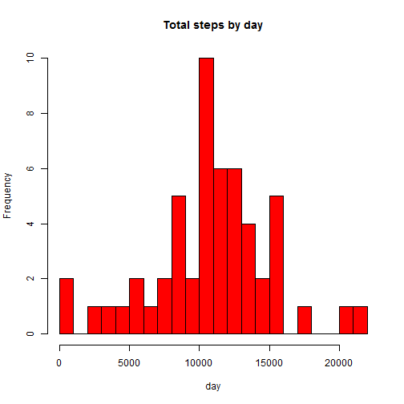
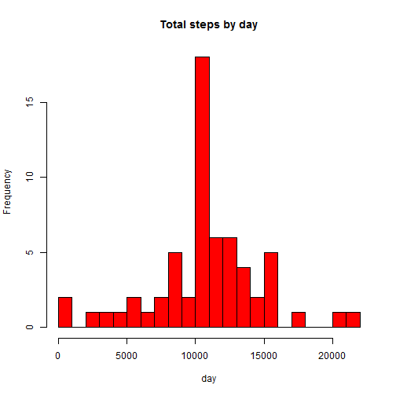
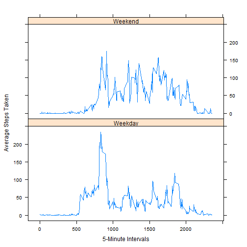

## Loading and preprocessing the data 
## Show any code that is needed to
## 1.Load the data (i.e. read.csv())
## 2.Process/transform the data (if necessary) into a format suitable for your analysis

## Download from URL 

dataset <- function () {
        fileurl <- "https://d396qusza40orc.cloudfront.net/repdata%2Fdata%2Factivity.zip"
        download.file(fileurl, destfile="./activity.zip", method="curl")
        system("unzip -d ./ ./activity.zip")
        system("rm -r ./activity.zip")
}
dataset()
activity <- read.csv("activity.csv", sep = ",", header = TRUE)

##alternative download from disk
## unzip the file and save on disk

## Download from file
##setwd("C:/Users/Vadim/Documents/IT_Education/Reproducible_Research")
 
##activity <- read.csv("activity.csv", sep = ",", header = TRUE)

## check structure or sumamry or head of activity 

str(activity)
summary(activity)
head(activity)

## What is mean total number of steps taken per day?
## 1.Make a histogram of the total number of steps taken each day
library(lattice)
library(knitr)


```r
activity$date <- as.Date(activity$date, "%Y-%m-%d")
dailysteps <- aggregate(steps ~ date, data = activity, FUN = sum, na.rm = TRUE)

hist(dailysteps$steps, main = "Total steps by day", xlab = "day", col = "red", breaks = 26)
```

 

## 2.Calculate and report the mean and median total number of steps taken per day

mean(dailysteps$steps)
median(dailysteps$steps)


## What is the average daily activity pattern? 
## 1. Make a time series plot (i.e. type = "l") of the 5-minute interval (x-axis) and the average number of steps taken, 
## averaged across all days (y-axis)


```r
intervalsteps <- aggregate(steps ~ interval, data = activity, FUN = mean)
plot(intervalsteps, type = "l")
```

 

## 2. Which 5-minute interval, on average across all the days in the dataset, contains the maximum number of steps?

intervalsteps$interval[which.max(intervalsteps$steps)]

## Imputing missing values

## 1.Calculate and report the total number of missing values in the dataset (i.e. the total number of rows with NAs)
sum(is.na(activity))

## 2.Devise a strategy for filling in all of the missing values in the dataset. 
## The strategy does not need to be sophisticated. For example, you could use the mean/median for that day, 
## or the mean for that 5-minute interval, etc.

stepsbyinterval <- aggregate(steps ~ interval, data = activity, FUN = mean)
fillNA <- numeric()
for (i in 1:nrow(activity)) {
        obs <- activity[i, ]
        if (is.na(obs$steps)) {
                steps <- subset(stepsbyinterval, interval == obs$interval)$steps
        } else {
                steps <- obs$steps
        }
        fillNA <- c(fillNA, steps)
}
## 3. Create a new dataset that is equal to the original dataset but with the missing data filled in.
activityfilled <- activity
activityfilled$steps <- fillNA

## 4. Make a histogram of the total number of steps taken each day and Calculate and report the mean and median total number of steps taken per day.


```r
dailystepsfilled <- aggregate(steps ~ date, data = activityfilled, FUN = sum, na.rm = TRUE)
hist(dailystepsfilled$steps, main = "Total steps by day", xlab = "day", col = "red", breaks = 26)
```

 

mean(dailysteps$steps)
median(dailysteps$steps)
mean(dailystepsfilled$steps)
median(dailystepsfilled$steps)

##  Do these values differ from the estimates from the first part of the assignment?
## - They do not differ or almost do not differ
## What is the impact of imputing missing data on the estimates of the total daily number of steps?
## - The impact is insignificant

## Are there differences in activity patterns between weekdays and weekends?
## 1. Create a new factor variable in the dataset with two levels - "weekday" and "weekend" 
## indicating whether a given date is a weekday or weekend day.

activity$day <- weekdays(as.Date(activity$date))
daylevel <- vector()
for (i in 1:nrow(activity)) {
        if (activity$day[i] == "Saturday") {
                daylevel[i] <- "Weekend"
        } else if (activity$day[i] == "Sunday") {
                daylevel[i] <- "Weekend"
        } else {
                daylevel[i] <- "Weekday"
        }
}
activity$daylevel <- daylevel
activity$daylevel <- factor(activity$daylevel)

stepsbyday <- aggregate(steps ~ interval + daylevel, data = activity, mean)
names(stepsbyday) <- c("interval", "daylevel", "steps")

## 2. Make a panel plot containing a time series plot (i.e. type = "l") of the 5-minute interval (x-axis) 
## and the average number of steps taken, averaged across all weekday days or weekend days (y-axis).


```r
xyplot(steps ~ interval | factor(daylevel),
       data=stepsbyday,
       type = 'l',
       layout = c(1, 2),
       xlab="5-Minute Intervals",
       ylab="Average Steps Taken")
```

 
